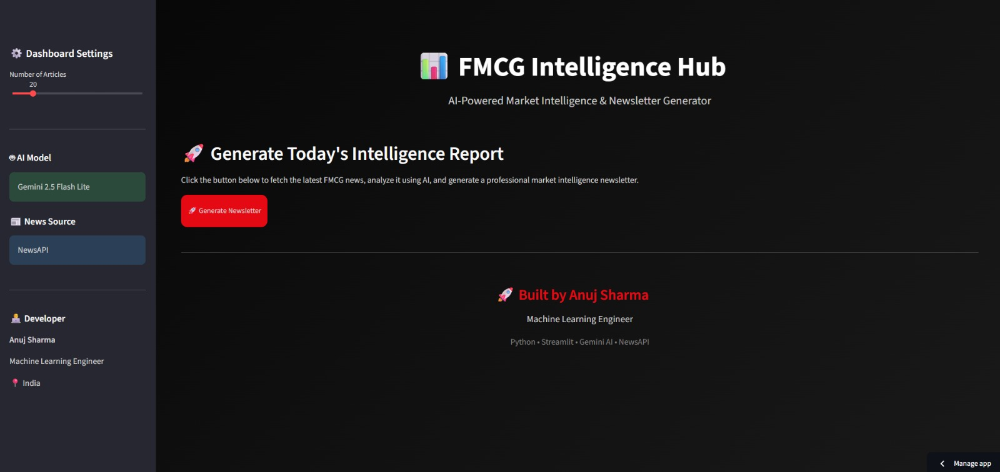

# 📊 FMCG Market Intelligence Dashboard

An AI-powered FMCG Market Intelligence Dashboard that automatically fetches the latest FMCG news, removes duplicate articles, filters relevant business news using Google's Gemini AI, assigns source credibility scores, and generates a professional market intelligence newsletter.

---

## 🚀 Features

- 📰 Fetches latest FMCG news using NewsAPI
- 🧹 Removes exact and near-duplicate articles using TF-IDF & Cosine Similarity
- 🤖 Filters relevant FMCG business news using Gemini AI
- ⭐ Assigns credibility scores based on news source
- 📝 Generates AI-powered professional newsletters
- 🎨 Interactive Streamlit Dashboard
- 📥 Download newsletter in Markdown format

---

## 🛠️ Tech Stack

- Python
- Streamlit
- Google Gemini API
- NewsAPI
- Pandas
- Scikit-learn
- Requests

---

## 📂 Project Structure

```
fmcg-market-intelligence-dashboard/
│
├── pipeline.py
├── preprocess.py
├── llm_filter.py
├── newsletter.py
├── streamlit_app.py
├── requirements.txt
├── README.md
└── data/
```

---

## ⚙️ Installation

Clone the repository

```bash
git clone https://github.com/Anujsharma-labs/fmcg-market-intelligence-dashboard.git
```

Move into the project directory

```bash
cd fmcg-market-intelligence-dashboard
```

Install dependencies

```bash
pip install -r requirements.txt
```

---

## 🔑 Configuration

Create a file named **config.py**

```python
Create a `.streamlit/secrets.toml` file:

API_KEY="YOUR_NEWS_API_KEY"
GEMINI_API_KEY="YOUR_GEMINI_API_KEY"
```

---

## ▶️ Run the Application

```bash
streamlit run streamlit_app.py
```

---

## 📊 Workflow

```
NewsAPI
      │
      ▼
Fetch News
      │
      ▼
Remove Duplicates
      │
      ▼
Gemini AI Filtering
      │
      ▼
Credibility Scoring
      │
      ▼
Newsletter Generation
      │
      ▼
Streamlit Dashboard
```

---

## 📸 Dashboard



---

## 🌐 Live Demo

Streamlit App:
https://fmcg-market-intelligence.streamlit.app/

## ⚠️ Note

This project uses Google's Gemini API. During testing, newsletter generation may temporarily fail if the free-tier API quota is exhausted. Re-running the application after the quota resets restores normal functionality.

---

## 👨‍💻 Author

### Anuj Sharma

Machine Learning & Data Science Enthusiast

📧 Email: anuj.sharma.work18@gmail.com

🔗 LinkedIn: https://www.linkedin.com/in/anuj-sharma-362063333

💻 GitHub: https://github.com/Anujsharma-labs

---

## ⭐ If you found this project useful, consider giving it a Star.
